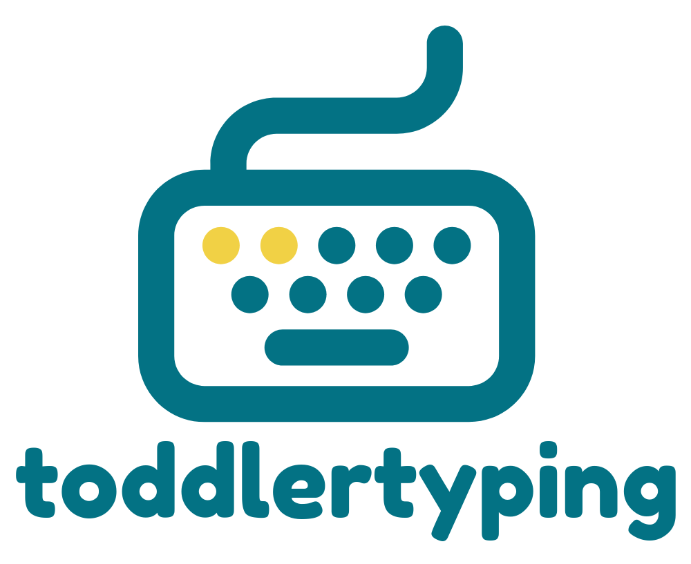

# typingfortoddlers

<div align="center">
  
</div>

An educational typing game designed for toddlers to learn keyboard skills through emoji-based object recognition. The game presents emojis representing objects (animals, food, vehicles, etc.) and math problems, and children type the corresponding word or solution.

## How to Use

1. Clone the repository:
```bash
git clone https://github.com/yourusername/typingfortoddlers.git
```

2. Install dependencies:
```bash
cd typingfortoddlers
npm install
```

3. Start the development server:
```bash
npm run dev
```

4. Open your browser and navigate to `http://localhost:3000`

5. For production build:
```bash
npm run build
npm start
```

The game includes a settings modal (accessible via the gear icon) where you can customize:
- Allow Words toggle
- Max Word Length settings
- Allow Math Problems toggle
- Addition/Subtraction problem types

All settings are saved to browser localStorage for persistence.

## License

This project is licensed under the GNU Affero General Public License v3.0 (AGPL-3.0) - see the [LICENSE](LICENSE) file for details.

The AGPL license ensures that if you modify and deploy this software (including as a service), you must make your modified source code available to users. This prevents others from taking the code, modifying it, and using it without sharing their changes.

